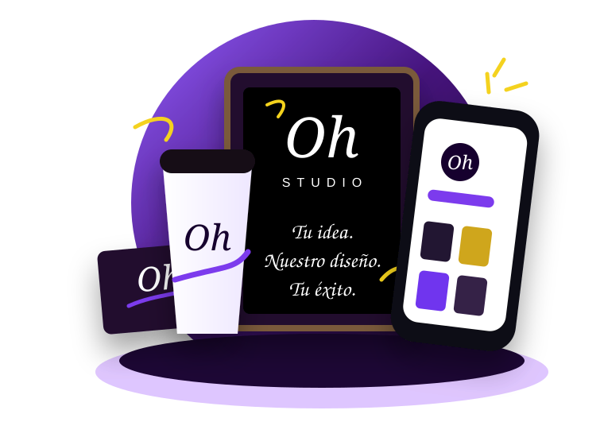

# Oh Studio - Landing One Page

Proyecto web estático para Oh Studio. No usa React, Vue, Bootstrap, Tailwind, jQuery, CDN ni librerías externas.

## Cómo abrir el proyecto

1. Abre la carpeta `OhStudio`.
2. Haz doble clic en `index.html`.
3. El sitio funciona de manera local, sin instalación, compilación, Node.js ni servidor.

## Estructura

```text
OhStudio/
├── index.html
├── css/
│   ├── styles.css
│   ├── responsive.css
│   └── animations.css
├── js/
│   ├── main.js
│   └── animations.js
├── assets/
│   ├── logo/
│   ├── images/
│   ├── icons/
│   ├── backgrounds/
│   └── mockups/
└── README.md
```

## Dónde cambiar WhatsApp

Abre `js/main.js` y edita:

```js
const WHATSAPP_LINK = "https://wa.me/5215512345678";
```

Todos los botones de cotización usan esa variable.

## Dónde cambiar Instagram

Abre `js/main.js` y edita:

```js
const INSTAGRAM_LINK = "https://instagram.com/ohstudio.mx";
```

Todos los enlaces de Instagram usan esa variable.

## Dónde cambiar datos de contacto

En `js/main.js`, modifica el bloque:

```js
const CONTACT_INFO = {
  phone: "55 1234 5678",
  email: "hola@ohstudio.mx",
  instagram: "@ohstudio.mx",
  location: "Ciudad de México"
};
```

## Dónde cambiar precios

En `js/main.js`, modifica:

```js
const PACKAGE_PRICES = {
  esencial: "$4,900",
  completo: "$9,900",
  premium: "$16,900"
};
```

Los nombres, textos e inclusiones de cada paquete están en `index.html`, dentro de la sección `#paquetes`.

## Dónde cambiar textos

El contenido principal está en `index.html`, organizado por secciones:

- `#inicio`
- `#servicios`
- `#proyectos`
- `#ecosistema`
- `#paquetes`
- `#proceso`
- `#contacto`

## Cómo reemplazar el logo o imágenes

- Logo principal: `assets/logo/oh-studio-logo.svg`
- Favicon: `assets/logo/favicon.svg`
- Proyectos antes/después: `assets/images/`
- Ecosistema visual: `assets/mockups/ecosystem-scene.svg`

Puedes reemplazar los archivos conservando el mismo nombre para no cambiar rutas en el HTML.

## Cómo subirlo a hosting

Sube la carpeta `OhStudio` completa a cualquier hosting estático. El archivo principal debe ser `index.html`.

Opciones comunes:

- Netlify
- Vercel como sitio estático
- GitHub Pages
- Hosting tradicional con cPanel

## Preparado para crecer

La estructura deja separados contenido, estilos, animaciones, assets y configuración editable para crecer después con portafolio completo, casos de estudio, blog, formulario real, más paquetes, agenda, tienda o panel administrativo.

## Cambiar la imagen principal del inicio

El hero usa una sola imagen editable:

```text
assets/images/hero-main-mockup.svg
```

Para cambiarla, reemplaza ese archivo por tu imagen manteniendo el mismo nombre, o cambia la ruta en `index.html` donde aparece:

```html

```

## Cambiar imágenes de la galería

La galería de proyectos usa estos archivos ficticios:

```text
assets/images/gallery-01.svg
assets/images/gallery-02.svg
assets/images/gallery-03.svg
assets/images/gallery-04.svg
assets/images/gallery-05.svg
assets/images/gallery-06.svg
```

Puedes reemplazarlos por fotos reales conservando los nombres, o editar las rutas dentro de la sección `#proyectos` en `index.html`.

## Editar el ecosistema visual

Los textos e imágenes que cambian al tocar `Marca e identidad`, `Espacios`, `Impresos`, `Redes sociales`, `Señalética` y `Web` están en `js/main.js`, dentro de:

```js
const ECOSYSTEM_CONTENT = { ... };
```
